# DNS & Certificate Management Module – Design & Development Specification

> Version: 0.1 – 2025-07-31

## 1. Scope & Goals
The DNS module delivers end-to-end lifecycle management for domains, certificates, and DNS records across multiple cloud providers (AWS Route 53, AliDNS, GoDaddy). It follows **existing project conventions** (clean-layered structure, Gin + Swaggo for API, Vue3 + Pinia on frontend) and integrates with the CMDB **Host** module for certificate deployment.

### Functional Highlights
1. **Domain Management**
   - CRUD, grouping, tagging, CSV/Excel batch import-export
   - Expiration reminders & health status
2. **Certificate Management**
   - One-click issue / renew via Let’s Encrypt (ACME v2)
   - DNS-01 automated challenges through supported providers
   - Secure storage (AES-256 encrypted) & downloadable bundles
   - Remote deployment to hosts via existing host-module SFTP/SSH adapters
   - Expiry / error alerts
3. **DNS Record Management**
   - CRUD for A/AAAA/CNAME/TXT/MX/SRV/NS/etc.
   - Zone sync & drift detection with cloud provider state
   - Change log & rollback
4. **Future-Proof Extras**
   - Secondary DNS (backup zone) support
   - DNSSEC key roll-over reminders
   - WHOIS privacy status tracking

---

## 2. Architecture Overview

```mermaid
%% ───── component diagram ─────
graph TD
  subgraph "Web Frontend"
    UI_Domains["Domains ⚙️"]
    UI_Certs["Certificates 🔒"]
    UI_DNS["DNS Records 🌐"]
  end
  subgraph "API Gateway"
    GinRouter((gin.RouterGroup))
  end
  subgraph "DNS Module"
    Handler["Handlers"]
    Service["Services"]
    Repo["Repositories"]
    Cron["Cron Jobs"]
  end
  subgraph "External"
    CMDB_Host["Host Module"]
    Providers["Cloud DNS APIs"]
    ACME["ACME (Let’s Encrypt)"]
    Vault["KMS / Vault"]
  end
  UI_Domains --> GinRouter
  UI_Certs --> GinRouter
  UI_DNS --> GinRouter
  GinRouter --> Handler
  Handler --> Service
  Service --> Repo
  Service -. SSH/SFTP .-> CMDB_Host
  Service -. DNS API .-> Providers
  Service -. ACME .-> ACME
  Service -. secrets .-> Vault
  Repo --> MySQL[(MySQL)]
  Cron --> Service
```



---

## 3. Backend Design
### 3.1 Packages & Directory
```
server/internal/
  api/handler/dns/
    domain_handler.go
    cert_handler.go
    record_handler.go
  model/dns/
    domain.go
    certificate.go
    dns_record.go
    group.go
    tag.go
    change_log.go
  repository/dns/
    domain_repo.go
    certificate_repo.go
    record_repo.go
    ...
  service/dns/
    domain_service.go
    cert_service.go
    record_service.go
    sync_service.go
  cron/dns/
    expiry_notifier.go   # domain & cert expiry
    zone_sync.go         # periodic provider sync
  router/dns/
    dns.go               # RegisterDNSEndpoints()
```
All files **must include** Swaggo annotations & follow existing error/response wrappers (`response/` pkg).

### 3.2 Database Schema (MySQL)
- `dns_domains`  (id, name, registrar, created_at, expires_at, status, group_id, ...)
- `dns_domain_tags` (domain_id, tag_id)
- `dns_certificates` (id, domain_id, provider, alg, cert_pem_enc, key_pem_enc, issued_at, expires_at, status)
- `dns_records` (id, domain_id, type, name, value, ttl, line, priority, status, provider, provider_record_id, synced_at)
- `dns_change_logs` (id, record_id, action, before_json, after_json, actor_id, created_at)

> **Encryption**: `*_pem_enc` columns are encrypted using AES-256-GCM with per-row unique IVs, master key in KMS.

### 3.3 API Endpoints (v1)
| Resource | Method | Path | Handler | Auth Scope |
|----------|--------|------|---------|------------|
| Domain   | GET    | /api/v1/dns/domains | ListDomains | dns:read |
|          | POST   | /api/v1/dns/domains | CreateDomain | dns:write |
|          | PUT    | /api/v1/dns/domains/{id} | UpdateDomain | dns:write |
|          | DELETE | /api/v1/dns/domains/{id} | DeleteDomain | dns:write |
|          | GET    | /api/v1/dns/domains/{id} | GetDomain | dns:read |
| Cert     | POST   | /api/v1/dns/certificates | IssueCert | cert:write |
|          | POST   | /api/v1/dns/certificates/{id}/renew | RenewCert | cert:write |
|          | GET    | /api/v1/dns/certificates | ListCerts | cert:read |
| Record   | GET    | /api/v1/dns/records | ListRecords | dns:read |
|          | POST   | /api/v1/dns/records | CreateRecord | dns:write |
|          | PUT    | /api/v1/dns/records/{id} | UpdateRecord | dns:write |
|          | DELETE | /api/v1/dns/records/{id} | DeleteRecord | dns:write |
| Sync     | POST   | /api/v1/dns/records/sync | SyncZone | dns:write |

Detailed request / response structs are defined in `docs/api_dns.yaml` (OpenAPI v3) – to be generated via Swaggo.

### 3.4 Cron Jobs
| Job | Schedule (cron) | Description |
|-----|-----------------|-------------|
| `domain_expiry_notifier` | `0 9 * * *` | Notify 30/7/1 days before domain expiry |
| `cert_expiry_notifier`   | `0 9 * * *` | Notify 30/7/1 days before cert expiry |
| `dns_zone_sync`          | `@every 5m` | Pull latest records & detect drift |

---

## 4. Frontend Design (Vue3 + Pinia + TypeScript)
### 4.1 Routes
```
/src/router/routes/asyncRoutes.ts
  └─ /dns
      ├─ /domains           -> views/dns/domain/DomainList.vue
      ├─ /certificates      -> views/dns/cert/CertList.vue
      └─ /records           -> views/dns/record/RecordList.vue
```
### 4.2 Store Modules
`/src/store/modules/dns.ts` – keep state slices: domains, certificates, records, loading.

### 4.3 Components
- `DomainTable.vue`, `DomainForm.vue`
- `CertTable.vue`, `CertRequestDialog.vue`
- `RecordTable.vue`, `RecordForm.vue`, `DiffViewer.vue`

### 4.4 UX Guidelines
- Use existing **KT-UI** components library for tables & forms
- Consistent tag coloring as CMDB host tags
- Wizard modal for certificate issuance
- Inline diff viewer for record changes

### 4.5 API Layer
Create `/src/api/dns/` endpoints mirroring backend paths, generated via Axios typed client.

---

## 5. Interaction with Host Module
1. Certificate deployment uses existing `service/cmdb/adapter` to SFTP files (`/etc/nginx/ssl/{domain}.pem`).
2. Deployment status saved in `dns_cert_deployments` table and emitted on `websocket://cert/status` channel for real-time UI updates.

---

## 6. Security & Compliance
- **RBAC**: integrate with existing middleware/jwt; new auth scopes: `dns:*`, `cert:*`.
- **Secrets**: private keys encrypted at rest; exposure only via signed URL with 5-min expiry.
- **Audit**: all mutating DNS operations recorded in `dns_change_logs`.

---

## 7. Coding Standards
- Follow Go linters `golangci-lint` (same config as root).
- CI pipeline: unit-tests + Swagger docs generation + SQL migration check.
- Frontend: ESLint + Prettier, commitlint (already configured).

---

## 8. Milestones
| Phase | Deliverables | ETA |
|-------|--------------|-----|
| P0 | DB migrations + models + repos | +3d |
| P1 | Domain & Record APIs + UI | +7d |
| P2 | Certificate issuance + deployment | +14d |
| P3 | Cron jobs, alerts, polish | +18d |
| P4 | Docs, tests (80% coverage) | +21d |

---

> **Next step**: generate database migration files and skeleton code before implementing business logic. 
