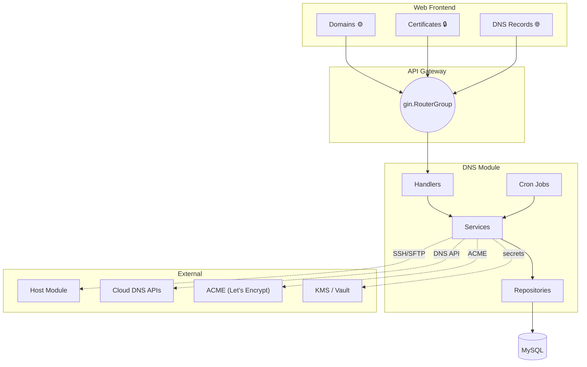
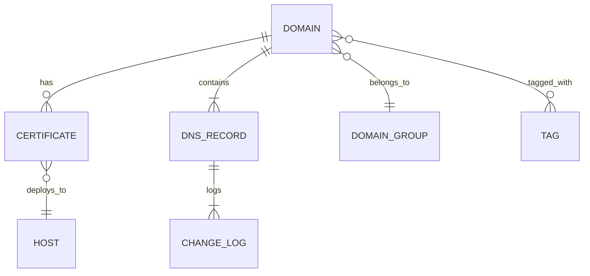
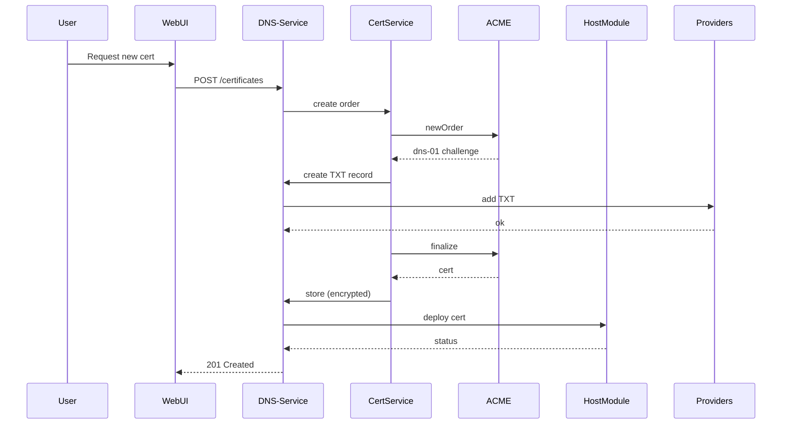
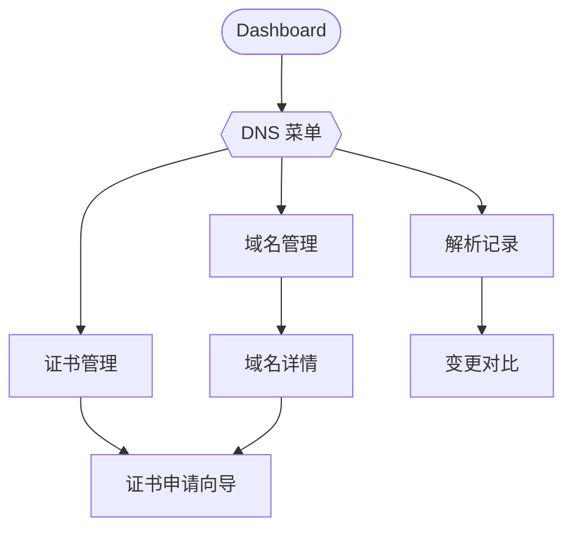
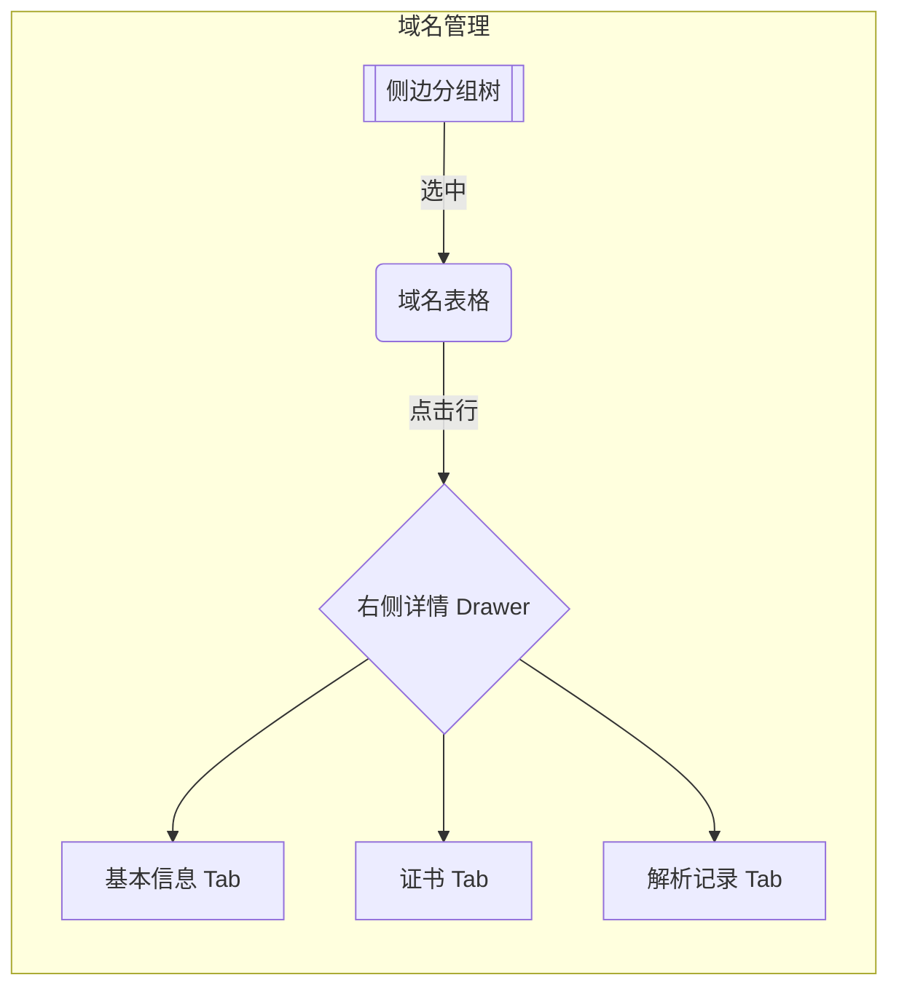
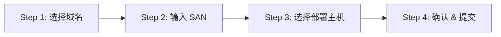

# DNS 与证书管理模块 — 设计与开发规范

> 版本：0.2 – 2025-07-31
> 负责人：DevOps 团队 / @your-name

---

## 1. 业务范围与目标
本模块在现有 DevOps 平台中提供从域名、证书到 DNS 解析生命周期管理的一站式能力，支持多云环境（AWS Route 53、阿里云 DNS、GoDaddy）。遵循平台既有【分层架构、DDD 轻量实现、Gin + Swaggo 后端、Vue 3 + Pinia 前端】规范，并与 CMDB 主机模块深度集成，实现远程证书部署。

**核心收益**：
1. 极简化日常运维流程：集中面板完成域名续费、证书签发、解析修改。
2. 风险可视：域名与证书到期、DNS 漂移实时预警。
3. 合规安全：私钥加密、操作审计、RBAC 权限细粒度控制。

---

## 2. 功能总览
| 模块 | 功能点 | 说明 |
|------|--------|------|
| 2.1 域名管理 | • 创建 / 编辑 / 删除<br>• 分组（文件夹树状）<br>• 标签系统（颜色可自定义）<br>• CSV / Excel 批量导入导出<br>• 到期自动提醒 | 到期阈值默认 30/7/1 天，通过邮件 & WebSocket 提醒 |
| 2.2 证书管理 | • Let’s Encrypt 一键申请 / 续期（ACME v2）<br>• 支持自定义 CSR 导入<br>• 证书文件 AES-256-GCM 加密存储<br>• 点击下载（5 分钟签名 URL）<br>• 部署至主机（SSH / SFTP）<br>• 异常 / 到期告警 | 依赖 DNS-01 Challenge，自动创建 TXT 记录 |
| 2.3 DNS 解析管理 | • 解析记录 CRUD（A、AAAA、CNAME、TXT、MX、SRV、NS…）<br>• 一键同步云厂商解析区<br>• 漂移检测 & 差异高亮<br>• 变更日志 & 可回滚 | 同步频率默认 5 分钟，可自定义 |
| 2.4 增值能力 | • Secondary DNS 备份
| • DNSSEC KSK/ZSK 轮换提醒
| • WHOIS 隐私保护状态监控
| • 灾备导出（RFC 1035 zone file） |

---

## 3. 架构概览






---

## 4. 后端设计
### 4.1 目录结构
```text
server/internal/
  api/handler/dns/          # HTTP Handler (Gin) + Swag 注解
  model/dns/                # GORM 模型
  repository/dns/           # 数据访问层 (Repo Pattern)
  service/dns/              # 业务逻辑层
  cron/dns/                 # 定时任务
  router/dns/               # 路由注册
  provider/dns/             # 云厂商适配器 (Interface + Impl)
```

### 4.2 数据库模型
详见 `migrations/20250731_create_dns_tables.sql`（待生成）。表设计要点：
1. 所有时间字段统一 `TIMESTAMP(6)` + `DEFAULT CURRENT_TIMESTAMP(6)`。
2. 敏感字段（证书、私钥）加密列后缀 `_enc`。
3. 软删除采用 `deleted_at` + `UNIQUE KEY (id, deleted_at)` 方案。

### 4.3 Provider 抽象
```go
// provider/dns/driver.go
package dns

type Driver interface {
    CreateRecord(ctx context.Context, req *Record) (string, error)
    UpdateRecord(ctx context.Context, req *Record) error
    DeleteRecord(ctx context.Context, recordID string) error
    ListRecords(ctx context.Context, zone string) ([]Record, error)
    // 证书 DNS-01 需要
    CreateTXTChallenge(ctx context.Context, domain, token string, ttl int) error
    DeleteTXTChallenge(ctx context.Context, domain, token string) error
}
```
使用 `factory` 按 provider 名称动态实例化。

### 4.4 API 规格
- 路由前缀：`/api/v1/dns`
- 返回体统一使用 `response.Success(data)` 与 `response.Error(err)`
- 详细 OpenAPI 文档见 `docs/api_dns.yaml`（Swag 自动生成）。

### 4.5 错误码规范（摘选）
| Code | HTTP | 含义 |
|------|------|------|
| 67001 | 400 | 域名已存在 |
| 67002 | 404 | 域名不存在 |
| 67101 | 500 | 证书签发失败 |
| 67201 | 409 | DNS 记录冲突 |

### 4.6 定时任务
| 名称 | cron 表达式 | 处理逻辑 |
|------|-------------|----------|
| `domain_expiry_notifier` | `0 9 * * *` | 30/7/1 天提前提醒 |
| `cert_expiry_notifier` | `0 9 * * *` | 同上 |
| `dns_zone_sync` | `@every 5m` | 解析同步 & 漂移检查 |

---

## 5. 前端设计（Element Plus 适配）

> 项目基于 **Vue 3 + Vite + Element Plus + TypeScript + Pinia** 技术栈。注意：虽然package.json中同时包含ant-design-vue和element-plus，但实际项目使用的是Element Plus组件库。

### 5.1 路由配置
1. 统一在 `src/router/modules/dns.ts` 定义子路由，采用 **路由分包** 形式：
```ts
// src/router/modules/dns.ts
export default [
  {
    path: '/dns',
    name: 'Dns',
    component: () => import('@/layout/BlankLayout.vue'),
    meta: { icon: 'icon-global', title: 'DNS 管理', orderNo: 40 },
    children: [
      { path: 'domains', name: 'DnsDomain', component: () => import('@/views/dns/domains/index.vue'), meta: { title: '域名', keepAlive: true } },
      { path: 'certs', name: 'DnsCert', component: () => import('@/views/dns/certs/index.vue'), meta: { title: '证书', keepAlive: true } },
      { path: 'records', name: 'DnsRecord', component: () => import('@/views/dns/records/index.vue'), meta: { title: '解析记录', keepAlive: true } }
    ]
  }
]
```
2. 在 `src/router/index.ts` 动态导入：
```ts
import dnsRoutes from './modules/dns';
router.addRoute(...dnsRoutes);
```

### 5.2 页面规范
- 页面文件放置于 `src/views/dns/*`，符合 Art Design Pro 目录结构。
- 使用 `PageWrapper` 组件承载表单/表格页，顶部集成内置 `PageHeader`。

| 视图 | 文件路径 | 组成 | 描述 |
|------|---------|------|------|
| 域名列表 | `views/dns/domains/index.vue` | `BasicTable` + `ModalForm` | 分组树 + 表格 + 导入/导出对话框 |
| 证书列表 | `views/dns/certs/index.vue` | `BasicTable` + `Drawer` | 支持向导对话框步骤条 |
| 解析记录 | `views/dns/records/index.vue` | `BasicTable` + `DiffViewer` | 云端 vs 本地差异高亮 |

### 5.3 状态管理
- `src/store/modules/dns.ts` 使用 Pinia：
```ts
export const useDnsStore = defineStore('dns', {
  state: () => ({ domains: [], certs: [], records: [], loading: false }),
  actions: { /* async api calls */ }
})
```

### 5.4 组件库
- **表格**：使用 Element Plus `el-table`（支持排序、分页、选择等功能）。
- **表单**：`el-form` / `el-dialog` / `el-drawer` 组合使用。
- **图标**：使用项目内置的 iconfont 图标系统。
- **权限指令**：`v-auth` —— 与平台现有实现一致，控制按钮显示。

### 5.5 国际化
- 按脚手架惯例，将中文文案放入 `src/locales/lang/zh-CN/dns.ts`，英文放入 `en-US/dns.ts`。

### 5.6 API 封装
- 使用项目内置的 HTTP 客户端，在 `src/api/dns/` 内生成 `domain.ts、certificate.ts、record.ts、provider.ts`：
```ts
export const domainApi = {
  list: (params) => request.get({ url: '/api/v1/dns/domains', params }),
  create: (data) => request.post({ url: '/api/v1/dns/domains', data }),
  // ...
}
```
- 对错误码统一处理，与平台现有错误处理机制保持一致。

### 5.7 样式
- 遵循项目现有主题变量，使用Element Plus的CSS变量系统，如：
```scss
:root {
  --el-color-primary: #165dff;
}
```

### 5.8 布局
- 使用项目现有的布局系统，侧边菜单将自动渲染配置的图标。

---

## 6. 安全合规
1. **RBAC**：新增权限 action
   - `dns:read / write`
   - `cert:read / write`
2. **Secret 管理**：
   - 私钥、token 加密后存储，密钥在 KMS；
   - 前端获取私钥文件走一次性 Signed URL，5 分钟有效。
3. **审计**：所有 mutation 请求记录至 `dns_change_logs`，包含 `actor_id / ip / ua`。

---

## 7. 监控与告警
| 指标 | 描述 | PromQL 示例 |
|------|------|-------------|
| `dns_sync_latency_seconds` | 最近一次 Zone 同步耗时 | `histogram_quantile(0.95, rate(dns_sync_latency_seconds_bucket[5m]))` |
| `cert_renew_fail_total` | 证书续期失败次数 | `increase(cert_renew_fail_total[1h])` |
| `domain_expiring_total` | 30 天内到期域名数 | `domain_expiring_total` |
Grafana Dashboard `DNS-Overview` 已预置，异常触发 Alertmanager → 飞书群组。

---

## 8. 测试策略
1. **单元测试**：Repo & Service 层覆盖 ≥ 80%。
2. **集成测试**：使用 LocalStack / ali-dns-mock 模拟云厂商 API。
3. **端到端**：Playwright 脚本覆盖证书申请全流程。
4. **安全测试**：OWASP Top-10 黑盒扫描；私钥是否可通过接口泄露。

---

## 9. CI/CD
- **backend**：`go test` → `golangci-lint` → 生成 `swagger.json` → Docker Build → image tag `dns-$SHA`。
- **frontend**：ESLint → Vitest → `pnpm build` → artifact upload。
- **部署**：Argo CD 自动部署 `kustomize/overlays/prod/dns`，蓝绿发布。

---

## 10. 性能与容量规划
- 单次同步最大支持 1 万条记录，接口分页 500。
- 预计 QPS ≤ 50，瓶颈主要在云 Provider API；采用 **并发 + 限速** 策略：每 Provider 并发 5，速率 10 req/s。

---

## 11. 国际化 & 多租户
- 所有文本及邮件模版使用 i18n（zh-CN / en-US）。
- 数据表加 `tenant_id`，通过 GORM `Scopes` 自动注入，确保租户隔离。

---

## 12. 里程碑（更新）
| 阶段 | 交付物 | 工期 |
|------|--------|------|
| P0 | DB Migration + Model + Repo + Provider SDK 接入 | +3d |
| P1 | 域名 & 解析 API + UI 基础页面 | +7d |
| P2 | 证书签发 & 部署全链路 | +14d |
| P3 | 监控/告警 + 定时任务 | +18d |
| P4 | E2E 测试 + 文档 + 上线评审 | +21d |

---

## 13. UI 原型图（Mermaid）

> 以下原型图仅用于开发阶段快速达成共识，实际像素级设计仍以 UI/UX 团队 Figma 为准。

### 13.1 页面导航流程


### 13.2 域名管理页面布局


### 13.3 证书申请向导


---

## 14. 开源工具对比与功能补强

| 维度 | 本模块（规划） | [certd/certd](https://github.com/certd/certd) | [allinssl/allinssl](https://github.com/allinssl/allinssl) | 其他（acme.sh 等） | 补强方向 |
|------|---------------|-----------------------------------------------|-----------------------------------------------------------|--------------------|-----------|
| 证书 ACME 支持 | Let’s Encrypt、ZeroSSL | Let’s Encrypt | Let’s Encrypt | 多 ACME CA | ✔ ZeroSSL / Buypass CA 接入 |
| Wildcard 证书 | 支持 | 支持 | 支持 | 支持 | 已覆盖 |
| 多云 DNS API | AWS、阿里云、GoDaddy (规划更多) | 阿里云、腾讯云、七牛等 | 阿里云、腾讯云 | 依赖用户脚本 | ➕ 华为云、Cloudflare、DNSPod |
| 自动部署插件 | 主机 SFTP/SSH、Nginx 热加载 | 宝塔、群晖、CDN | 待完善 | — | ➕ Kubernetes Ingress、Istio Secret 更新 |
| 通知渠道 | 邮件、Webhook、飞书 | 邮件、Webhook、企微、钉钉、飞书等 | 邮件 | — | ✔ 飞书已含；➕ Server 酱、Slack |
| 站点证书可用性监控 | 计划内（HTTPS 监控） | 支持 | 支持 | — | ✅ 列入里程碑 P3 |
| 可视化变更历史 | 支持 DNS Record Diff | 不强调 | 不强调 | — | 优势保持 |
| RBAC/Multi-Tenant | 支持 | 限单租户 | 限单租户 | — | 核心差异点 |
| 插件生态 | Provider/Deployer 接口 | 插件市场 | 较少 | Shell Hook | 保持接口开放，鼓励社区贡献 |
| 商业授权 | Apache-2.0 (平台整体) | AGPL-3.0 | 未说明 | GPLv3 | 保持开源友好 |

> 结论：功能覆盖度已与 certd 基本持平，下一步重点在 **多 CA 支持、更多云厂商 DNS、K8s 自动部署、HTTPS 监控** 四大增强点。

---

> **更新日志 0.2.1** — 添加 UI 原型图章节 & 开源工具对比，完善后续功能补强方向。 

---

## 15. 新增功能与实施方案（取长补短）

> 结合 certd、allinssl 等开源实践，聚焦以下 **5** 项增强：

### 15.1 多 CA 支持
- **目标**：支持 ZeroSSL、BuyPass Go 等 ACME CA，可按租户/域名选择 CA。
- **实现**：
  1. `provider/ca/driver.go` 定义 `CADriver` 接口（NewOrder / Finalize / Revoke）。
  2. `ca/factory.go` 根据 `ca_type` 动态返回 Let’sEncryptDriver、ZeroSSLDriver…
  3. 数据库 `dns_certificates` 新增列 `ca_type`；默认 `letsencrypt`。

### 15.2 更多 DNS Provider
- 新增 Cloudflare、DNSPod、华为云适配器；设计保持与现有 Driver 接口兼容。
- 统一 Provider 配置存储在 `dns_providers` 表（id、name、type、credentials_enc…）。

### 15.3 HTTPS 可用性监控
- **指标**：`https_cert_expiry_days`, `https_status`。
- **Cron**：`https_monitor`，每 10 分钟 GET 目标 URL；若 SSL 过期 < 7 天 或 HTTP 状态码 >=400 则告警。
- **DB**：`https_monitors` 表（id, domain_id, url, status, last_checked_at…）。

### 15.4 通知渠道扩展
- 现有邮件 / 飞书基础上，新增 Slack、企业微信、Server 酱。
- `notification/driver.go` + `factory.go` 插件化。

### 15.5 插件生态 & 动态加载
- 支持将 Provider / Deployer / Notifier 编译为 Go Plugin (`.so`)，运行时通过配置加载。
- 插件注册表 `plugins.yaml` 记录路径 & 版本。

---

## 16. 里程碑（v0.3 更新）
| 阶段 | 交付物 | 工期 |
|------|--------|------|
| P0 | 基础表迁移 + 核心 Driver（LE + AWS/阿里 + SFTP） | +3d |
| P1 | UI 基础 + Domain/Record API | +7d |
| P2 | 多 CA & 多 Provider Adapter | +11d |
| P3 | HTTPS Monitor + 扩展通知 | +15d |
| P4 | 插件生态框架 & 示例 Plugin | +18d |
| P5 | 全链路 E2E + 压测 + 文档 | +22d |

> **建议**：先以一条主链（Let’sEncrypt → AWS DNS → SFTP 部署）打通 MVP，再并行开发扩展 Driver；插件机制可在 P4 引入，避免前期复杂度过高。

---

## 17. 开发进度跟踪 (2025-08-01)

### 17.1 当前总体进度：**75%**

| 里程碑 | 状态 | 完成度 | 说明 |
|--------|------|--------|------|
| P0: 基础设施 | ✅ 已完成 | 100% | 数据库迁移、GORM模型、Repository层、Provider抽象层已实现 |
| P1: API + UI | 🔄 进行中 | 85% | 后端Service/Handler/Router已完成，前端UI已创建但需修复组件库 |
| P2: 证书全链路 | ⏸️ 待开始 | 0% | 依赖P1完成 |
| P3: 监控告警 | ⏸️ 待开始 | 0% | 依赖前序阶段 |
| P4: 插件生态 | ⏸️ 待开始 | 0% | 依赖前序阶段 |
| P5: 测试文档 | ⏸️ 待开始 | 0% | 依赖前序阶段 |

### 17.2 已完成内容 ✅

#### P0: 后端基础架构（100%完成）
- ✅ **数据库表设计** - 完整的DNS模块表结构（domains, certificates, records, providers等）
- ✅ **GORM模型** - `server/internal/model/dns/` 下所有模型文件
- ✅ **Repository层** - 数据访问层实现，遵循现有Repository模式
- ✅ **Provider抽象层** - DNS Provider接口和Factory模式设计
- ✅ **数据库迁移** - 集成到migration.go，自动创建表和菜单数据

#### P1: 后端API层（100%完成）
- ✅ **Service层** - `server/internal/service/dns/` 下完整业务逻辑层
- ✅ **Handler层** - `server/internal/api/handler/dns/` 下HTTP处理器，包含Swagger注解
- ✅ **路由注册** - `server/internal/router/dns/` 路由配置，集成到主路由系统
- ✅ **错误码定义** - DNS模块专用错误码（67001-67201范围）

#### P1: 前端页面层（90%完成）
- ✅ `/dns/domains` - 域名管理页面（功能完整，但UI组件库需修复）
- ✅ `/dns/certs` - 证书管理页面（功能完整，但UI组件库需修复）
- ✅ `/dns/records` - 解析记录页面（功能完整，但UI组件库需修复）
- ✅ DNS菜单配置 - 三级菜单结构已在系统中配置并可正常访问

#### 前端API接口层（100%完成）
- ✅ `certificateApi` - 证书管理API封装
- ✅ `domainApi` - 域名管理API封装
- ✅ `recordApi` - 解析记录API封装
- ✅ `dnsProviderApi` - DNS提供商API封装
- ✅ TypeScript类型定义 - DNS相关完整类型定义

### 17.3 存在问题 ❌

#### 关键问题
1. **UI组件库不匹配** 🚨
   - 问题：创建的DNS页面使用了Ant Design Vue组件（`a-*`）
   - 实际：项目使用Element Plus组件库（`el-*`）
   - 影响：页面无法正常渲染，控制台大量组件解析错误
   - 优先级：**高** - 需要立即修复

#### 次要问题
2. **前后端联调待测试** - 需要验证前端API调用与后端接口的对接
3. **缺少Mock数据** - 影响前端开发体验
4. **文档中的Art Design Pro描述不准确** - 实际项目使用Element Plus而非Ant Design Vue

### 17.4 下一步行动计划

#### 立即执行（本周）
1. **修复UI组件库问题** 🚨
   - 将所有DNS页面的`a-*`组件替换为`el-*`组件
   - 调整样式和交互逻辑以适配Element Plus
   - 验证页面功能正常

2. **前后端联调测试**
   - 启动后端服务，验证API接口正常工作
   - 测试前端页面与后端API的数据交互
   - 修复可能存在的接口对接问题

#### 后续执行（下周）
3. **完善功能细节**
   - 添加数据验证和错误处理
   - 优化用户体验和界面交互
   - 添加Loading状态和错误提示

4. **Provider SDK接入**
   - 接入阿里云DNS SDK
   - 接入AWS Route53 SDK
   - 实现DNS记录同步功能

### 17.5 风险评估

| 风险项 | 影响 | 概率 | 缓解措施 |
|--------|------|------|----------|
| UI组件库重构工作量大 | 高 | 中 | 分页面逐步替换，保持功能不变 |
| 后端API设计变更 | 中 | 低 | 严格按照文档设计，减少变更 |
| 第三方SDK集成复杂 | 中 | 中 | 先实现Mock Provider，再接入真实SDK |

---

> **更新日志 0.3.1** — 添加开发进度跟踪章节，标注当前状态和问题。

### 5.0 动态路由与菜单规范

Art Design Pro 已内置“动态路由”机制：前端启动后从 `/api/v1/system/menus` 拉取菜单 JSON → 解析为 `RouteRecordRaw`，再注入 `router.addRoute()`。因此 **DNS 模块不再写死路由文件**，而是通过后端菜单表 `system_menus` 生成。

#### 5.0.1 菜单字段规范
| 字段 | 示例 | 说明 |
|------|------|------|
| `id` | 40 | 主键，需保持全局唯一 |
| `path` | `/dns` 或子路径 | 一级菜单以 `/` 开头，子菜单相对路径 |
| `name` | `Dns` | 保持与前端 `name` 字段一致，供 `<RouteView>` 缓存 |
| `component` | `/index/index` | 一级菜单使用占位布局；子菜单指向实际组件文件路径（去掉 `src/views` 前缀，保留 `.vue` 前缀前的路径） |
| `title` | `DNS 管理` | i18n key 或中文标题 |
| `icon` | `&#xe6a0;` | 使用 iconfont 编码或 Ant Icon 名称 |
| `level` | 1 / 2 | 菜单层级（系统约定） |
| `parent_id` | 0 / 40 | 父菜单 ID |
| `keep_alive` | 1/2 | 1=不缓存、2=缓存 |

#### 5.0.2 DNS 菜单 SQL 示例
```sql
-- version 1.3.0 – add DNS menus
INSERT INTO system_menus (id, path, name, component, title, icon, keep_alive, status, level, parent_id, sort, is_hide)
VALUES
  (40, '/dns',  'Dns',         '/index/index',       'DNS 管理', '&#xe6a0;', 2, 1, 1, 0, 60, 0),
  (41, 'domains', 'DnsDomain', '/dns/domains/index', '域名管理', '&#xe693;', 2, 1, 2, 40, 99, 0),
  (42, 'certs',   'DnsCert',   '/dns/certs/index',   '证书管理', '&#xe66a;', 2, 1, 2, 40, 88, 0),
  (43, 'records', 'DnsRecord', '/dns/records/index', '解析记录', '&#xe67a;', 2, 1, 2, 40, 77, 0);
```
> ⚠️ **ID 号段**：请预留 40–49 给 DNS 模块，避免与现有菜单冲突。

#### 5.0.3 迁移脚本
在 `server/internal/db/migration.go` 的 `pendingMigrations` 列表追加：
```go
{"1.3.0", "Add DNS module menus", ensureDNSMenus},
```
并实现函数：
```go
func ensureDNSMenus(db *gorm.DB) error {
    return db.Transaction(func(tx *gorm.DB) error {
        dnsMenus := []MenuConfig{ /* 上述 4 条 */ }
        return migrateMenuData(tx, dnsMenus)
    })
}
```
系统初始化或升级后，前端即可自动渲染侧边栏与动态路由。

#### 5.0.4 本地开发快捷方式
若后端接口暂未就绪，可在 `src/router/modules/temp-dns.ts` 中临时写静态路由，提交前务必删除。

---
